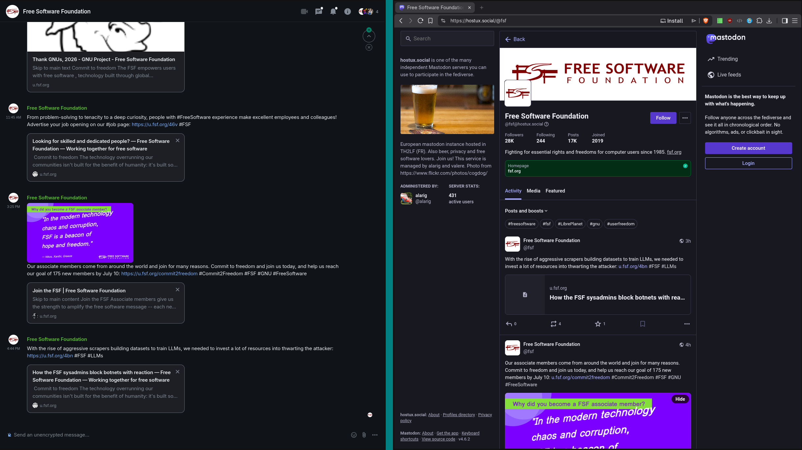

# matrix-appservice-activitypub



Turns your Matrix server into a fully functioning ActivityPub server. Matrix  users can post, follow, reply, react, and DM across the fediverse using ordinary Matrix rooms and clients. No separate account or server needed.

Runs natively as a single Python process, no containers required. It talks to your homeserver through the Client-Server API (plus the Application Service push API for inbound events), never by touching its database directly. It also stores no post content or media of its own; that all lives in Matrix rooms. The only local state is bookkeeping (linked identities, follow relationships, keys, and the Matrix-event/ActivityPub-object map), kept in a SQLite file or a Postgres database.

## Core concepts

Every ActivityPub identity or conversation the bridge manages is backed by an ordinary Matrix room, of one of five kinds:

- **Profile Room**: a local Matrix user's own linked ActivityPub identity (`username@bridge.domain`). Posting here publishes to the fediverse, and the room's membership doubles as a visible follower list.
- **Remote User Room**: one shared room per remote fediverse account, mirroring everything they post. Created the first time anyone follows or imports from that account, and reused by every local follower after that.
- **Ghost DM room**: a private 1:1 room between a local user and a remote account, carrying ActivityPub `Note`-based direct messages.
- **Ghost Chat room**: a private 1:1 room carrying ActivityPub `ChatMessage`s (Pleroma/Akkoma's separate instant-messaging concept). Deliberately never the same room as a DM, even between the same two parties.
- **Notification room**: a private 1:1 room between a local user and the bridge bot itself, named "Fediverse Notifications". Notification messages for new followers, mentions, reposts, and likes/reactions land here.

Every remote account you interact with gets a deterministic "ghost" Matrix user (`@ap_user_instance:yourdomain`) that posts, reacts, and DMs on their behalf inside Matrix. Its display name, avatar, and (for a Remote User Room) banner stay in sync with their real ActivityPub profile.

## What's bridged

### Posts, replies, and threads

- **New posts**: a message in your linked Profile Room becomes an outgoing `Create{Note}`, addressed publicly and delivered to your followers' inboxes (plus anyone mentioned).
- **Incoming posts**: a followed account's `Create{Note}` is mirrored as a plain Matrix message into their Remote User Room. It's HTML-sanitized to a safe tag subset and deduplicated by the post's ActivityPub object ID.
- **Replies, both directions**: a Matrix reply or thread-reply to a mirrored post federates out with the correct `inReplyTo`, tagging the parent author and every other participant already in the thread (fetched live from the parent, so the "reply to @a @b" line reads correctly on the far end). Incoming replies are mirrored as real Matrix thread replies, walking up untracked ancestors and auto-importing the true root if needed so the reply always has somewhere real to land.
- **Guest posting**: a different local user posting inside someone else's Profile Room federates as their own post, under their own actor and outbox, with the room owner auto-mentioned.
- **Edits**: a Matrix edit (`m.replace`) federates as `Update` on the same Note ID, never delete-and-recreate, so replies, likes, and reposts referencing it stay intact.
- **Deletes**: redacting your own distributed post sends a signed `Delete` to every follower. An incoming `Delete` for a tracked post redacts the mirrored Matrix event, but only if the sender actually matches the recorded author.
- **Backfill**: `;backfill` (or an inbound reply chain with gaps) pulls an account's outbox or a specific thread's replies through the exact same mirroring path a live delivery uses, so history is indistinguishable from anything that arrived live.
- **Quote-posts**: Akkoma/Pleroma/Fedibird/Misskey-style quote fields are detected on the way in (any auto-appended "RT: link" fallback text is stripped) and rendered as a quote card. `;repost <caption>` sends a real quote-post of your own the other way.

### Reactions and reposts

- **Reactions**: a plain 👍 Matrix reaction sends `Like`. Any other emoji sends `EmojiReact` (a Pleroma/Misskey/Akkoma extension) carrying the literal emoji. Incoming `Like`/`EmojiReact` become `m.reaction` events from a ghost, and redacting a reaction in either direction sends or receives the matching `Undo`.
- **Reposts**: reacting with 🔁, or running bare `;repost` as a reply, sends a real `Announce` (not a Like) to both your followers and the original author, plus a "🔁 you reposted" card in your own Profile Room. An incoming `Announce` renders the same card and independently imports the reposted post into its original author's own room, so it's reply/react-able there too. Un-reposting (redacting the reaction, the command, or the card, all three are linked) sends `Undo(Announce)`.
- **Custom emoji**: Pleroma/Misskey/Akkoma image-emoji shortcodes (in post text, reactions, or display names) are resolved against the object's own metadata to an uploaded `mxc://` image and inlined next to the shortcode text, in both directions.

### Polls

- Polls are bridged bidirectionally, as real Matrix poll widgets (MSC3381), not text. A Profile Room poll becomes a `Create{Question}`; an incoming poll from a followed account is mirrored the same way a post is, but as an actual interactive poll.
- Voting either direction works: a local vote on a mirrored (remote-owned) poll federates out as a private vote to the poll's author; a remote vote on your own poll makes that voter's ghost cast a real Matrix poll response, so Matrix's own widget tallies it alongside everyone else's.
- A mirrored poll's results are shown as a "Fediverse Tallies" thread reply, seeded from whatever the poll already shows at import time and actively refreshed after a vote or via `;refresh poll` -- some remote servers (confirmed for Pleroma/Akkoma) never push a live tally update over federation at all, so this doesn't rely solely on one arriving.
- An incoming poll closing is mirrored as a real poll-end event in the same thread.

### Direct messages and chats

- **DMs** (`;dm`): a private, non-public `Create{Note}` addressed only to the recipient, in a dedicated ghost DM room. Threaded if replying within that same room.
- **Chats** (`;chat`): Pleroma/Akkoma's separate `ChatMessage` concept, in its own dedicated room type, flat with no threading. Also started by simply inviting a ghost into a fresh Matrix DM directly.
- Both directions mirror faithfully. An inbound private `Note`/`ChatMessage` lands in the matching room type, and a Matrix message sent there federates back out the same way.

### Mentions

- A Matrix client's structured mention (`m.mentions`) of a ghost or fellow local user is rewritten to `@user@domain` text and added as a real AS2 `Mention` tag on the way out. A hand-typed `@user@instance.org` is resolved the same way via WebFinger.
- Incoming `Mention` tags are matched by handle, not raw URL since they routinely differ, against known ghosts/local users and rendered as genuine Matrix mention pills.

### Media

- Incoming attachments (image, video, audio, document) are downloaded and re-uploaded as real Matrix media. Extra attachments beyond the first are appended as links, since one ActivityPub post maps to exactly one Matrix event.
- Outgoing Matrix media becomes an ActivityPub `attachment` pointing at the bridge's own public media proxy (`/media/{server}/{id}`), never your homeserver directly, since remote servers have no Matrix access token. Only media explicitly published this way is ever served.

### Follows and moderation

- **Follows**: `;follow` sends a signed `Follow`. An incoming `Follow` is auto-accepted (or auto-rejected if the follower is blocked), recorded, and reflected as a ghost invite into your Profile Room, so room membership doubles as your visible follower list.
- **Unfollow**: leaving or being kicked from a Remote User Room sends a real `Undo(Follow)` under your own identity. An incoming `Undo(Follow)` just drops the follower record.
- **Block**: cuts any existing follow (a real `Undo(Follow)` if you were following them), kicks you from their rooms, declines future follows with a real `Reject`, and silences notifications, all in one command. An incoming `Block` surfaces as a notification and silently drops the follower record, since AP has no separate unfollow signal for a block.
- **Mute**: suppresses notifications and auto-invites from an account without touching the follow relationship or their content.
- **Followers/following visibility**: `;hide`/`;show` withholds just the member list of your public collections. Counts stay public either way, matching Mastodon's "hide network" convention.

### Profile and identity

- Linking or creating a profile mints an ActivityPub `Actor` document with its own RSA keypair. Your room's name, topic, and avatar map to the actor's name, bio, and icon, pushed live as `Update` on every change.
- `;banner` sets the actor's header image via `m.room.banner` (MSC4221, currently under its own unstable prefix since Matrix has no stable room banner concept yet).
- MSC4501 discoverability: a linked Profile Room gets `m.social.profile_user_id` (asserting who it actually belongs to, since the bridge's bot is always its technical creator) with a power level requiring the room's owner to change it, and a ghost's Remote User Room gets `m.social.profile_room_id` set on their own Matrix profile pointing back at it. Both stay in sync across a `;replace room`.
- An incoming profile change (`Update{Person}`) syncs the Remote User Room's name/avatar/banner and the ghost's own Matrix profile.
- `;replace room` recreates the Matrix room behind any identity (Profile Room, Remote User Room, DM, or Chat room) to pick up newer bridge features. It's entirely Matrix-side; nothing is sent over ActivityPub, since the identity itself doesn't change.
- `;delete profile` is a confirmation-gated, irreversible account deletion. It sends a signed `Delete` to every follower, then erases the local identity.

### Discovery and federation plumbing

- **HTTP Signatures** on every outbound activity and every inbound delivery, including cross-checking the signing key's actor against the activity's own claimed actor to reject spoofing.
- **WebFinger**, both serving local identities for remote discovery and resolving remote handles for outgoing follows, mentions, and DMs.
- **Outbox/followers/following/actor pages** are all served live, reconstructed from actual Matrix room state and history on every request, never cached separately, in keeping with the project's philosophy that Matrix is the only place content lives.
- A **shared inbox** endpoint, plus per-actor inboxes, both signature-verified.
- **Knock-based self-service room access**: every bridge room uses Matrix's `knock` join rule, and a knock from that room's rightful local owner (current or a past, since-replaced room) is auto-accepted without side effects.

For the exact ActivityPub activity types, Matrix event shapes, and implementation entry points behind each of these, see the source: `bridge/inbox_dispatch.py` for incoming, `bridge/note_mirroring.py`/`bridge/reply_bridge.py`/`bridge/reaction_bridge.py`/`bridge/edit_bridge.py`/`bridge/chat_bridge.py` for outgoing, and `bridge/activitypub/routes.py` for the ActivityPub HTTP surface the bridge itself serves.

## Bot commands

Everything above is controlled from inside Matrix by tagging the bridge bot or typing a `;`-prefixed command (`;follow @user@instance.org`, `;help`, and so on). See [COMMANDS.md](COMMANDS.md) for the complete reference.

## What homeservers are supported?

Synapse is the only homeserver this bridge has actually been tested against. It should work against any other spec-compliant homeserver in theory, with one exception: `bridge.use_synapse_admin_api` (on by default) depends on Synapse's own Admin API, which isn't part of the spec and other implementations aren't guaranteed to have. Turn it off if you're not running Synapse.

Running on other homeservers is untested, experimental territory as of this writing. When turning `bridge.use_synapse_admin_api` off: populate `bridge.admins` (see `config.example.yaml`), since admin status no longer falls back to a Synapse API check. As soon as the bridge is started up, spot-test every command by hand rather than assuming it behaves the same as the Synapse-backed path; and watch the bridge's logs closely to make sure you're not getting any unexpected errors.

## Setup

1. Install dependencies and generate a config:

   ```sh
   ./scripts/setup.sh
   ```

   This creates a virtualenv, installs `requirements.txt`, and generates `config.yaml` from `config.example.yaml` with fresh random AppService tokens.

2. Edit `config.yaml`. At minimum set `bridge.domain`, `bridge.public_base_url`, `synapse.base_url`, and `synapse.server_name` (these fields are named after Synapse, but just mean "your homeserver" -- see "What homeservers are supported?" above). Also set `synapse.admin_token` (an access token for a homeserver account with `admin: true`) unless you've explicitly turned off `bridge.use_synapse_admin_api`. See `config.example.yaml` for every option; each is documented inline (storage backend, logging level, federation timeouts, backfill defaults, and more).

3. Generate the AppService registration and wire it into your homeserver:

   ```sh
   .venv/bin/python -m bridge.appservice config.yaml appservice-registration.yaml
   ```

   Add the resulting file's path to your homeserver's own application-service registration config (`app_service_config_files` in `homeserver.yaml`, if you're running Synapse), then restart it.

4. Run the bridge:

   ```sh
   .venv/bin/python main.py
   ```

   Or install `deploy/matrix-appservice-activitypub.service` to run it under systemd (see that file for the expected user/paths). `deploy/nginx.conf.example` shows a reverse-proxy config for exposing the ActivityPub surface on the same public domain as your homeserver. That's recommended, since it's what makes a user's Matrix ID and fediverse handle the exact same string (`@alice:example.org` == `@alice@example.org`).

5. Optionally, verify end-to-end:

   ```sh
   .venv/bin/python scripts/simulate_remote_follow.py --username <a-linked-profile>
   ```

## Storage

Bookkeeping (linked identities and their keys, follow relationships, ghost profiles, the Matrix-event/ActivityPub-object map, and room-history tables used for knock/backfill/outbox continuity after a `;replace room`) lives in either a local SQLite file (`storage.backend: sqlite`, the default) or Postgres (`storage.backend: postgresql`), selected in `config.yaml`. Same schema and content either way. No post content or media is stored outside Matrix itself.
