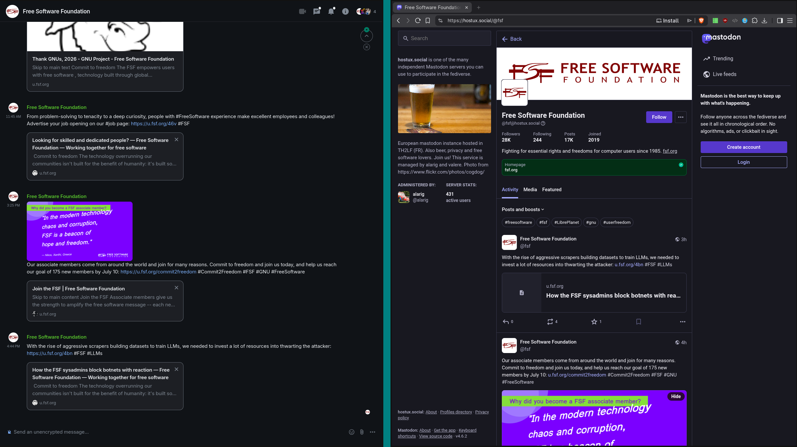

# matrix-appservice-activitypub



Turns your Matrix server into a fully functioning ActivityPub server. Matrix  users can post, follow, reply, react, and DM across the fediverse using ordinary Matrix rooms and clients. No separate account or server needed.

Runs natively as a single Python process, no containers required. It talks to your homeserver through the Client-Server API (plus the Application Service push API for inbound events), never by touching its database directly. It also stores no post content or media of its own; that all lives in Matrix rooms. The only local state is bookkeeping (linked identities, follow relationships, keys, and the Matrix-event/ActivityPub-object map), kept in a SQLite file or a Postgres database.

## Core concepts

Every ActivityPub identity or conversation the bridge manages is backed by an ordinary Matrix room, of one of these kinds:

- **Profile Room**: a local Matrix user's own linked ActivityPub identity (`username@bridge.domain`). Posting here publishes to the fediverse, and the room's membership doubles as a visible follower list.
- **Remote User Room**: one shared room per remote fediverse account, mirroring everything they post. Created the first time anyone follows or imports from that account, and reused by every local follower after that.
- **Ghost DM room**: a private 1:1 room between a local user and a remote account, carrying ActivityPub `Note`-based direct messages.
- **Ghost Chat room**: a private 1:1 room carrying ActivityPub `ChatMessage`s (Pleroma/Akkoma's separate instant-messaging concept). Deliberately never the same room as a DM, even between the same two parties.
- **Notification room**: a private 1:1 room between a local user and the bridge bot itself, named "Fediverse Notifications". Notification messages for new followers, mentions, reposts, and likes/reactions land here.
- **PeerTube Channel room** (opt-in, `bridge.peertube_channels_enabled`): a Matrix room turned into a real, federating PeerTube-compatible video channel with its own ActivityPub identity, owned by a linked Profile. Posting a video here and running `;publish` federates it to the fediverse.
- **Guild Space**: a Matrix Space representing a joined Shoot guild (an `Organization` actor), created once the guild's `Accept` for a `;joinguild` (or auto-join) comes back.
- **Guild Channel room**: one of that guild's text channels, mirrored into a child room under its Guild Space -- created for a channel already known when the guild was joined, or the first time anyone posts in a newer one otherwise.

Every remote account you interact with gets a deterministic "ghost" Matrix user (`@ap_user_instance:yourdomain`) that posts, reacts, and DMs on their behalf inside Matrix. Its display name, avatar, and (for a Remote User Room) banner stay in sync with their real ActivityPub profile.

## What's bridged

- Posts, replies, and threads
- Reactions and reposts
- Polls
- Direct messages and chats
- Mentions
- Media
- Follows and moderation
- Profile and identity
- PeerTube video channels, publishing and following
- Guilds and channels (Shoot), joined via invite code or automatically by joining a Matrix room
- Discovery and federation plumbing

See [FEATURES.md](FEATURES.md) for a breakdown of how each of these is actually bridged.

## Controlling the bridge

Most of what's above just happens through ordinary Matrix actions: sending a message, reacting, replying, editing. For everything else, like following an account, starting a DM, or managing your profile, tag the bridge bot or type a `;`-prefixed command (`;follow @user@instance.org`, `;help`, and so on), or use the room widget the bridge automatically adds to every room it creates, with buttons for most of those same commands. See [COMMANDS.md](COMMANDS.md) for the complete reference, including the widget's own entry.

## What homeservers are supported?

Synapse is the only homeserver this bridge has actually been tested against. It should work against any other spec-compliant homeserver in theory, with one exception: `bridge.use_synapse_admin_api` (on by default) depends on Synapse's own Admin API, which isn't part of the spec and other implementations aren't guaranteed to have. Turn it off if you're not running Synapse.

Running on other homeservers is untested, experimental territory as of this writing. When turning `bridge.use_synapse_admin_api` off: populate `bridge.admins` (see `config.example.yaml`), since admin status no longer falls back to a Synapse API check. As soon as the bridge is started up, spot-test every command by hand rather than assuming it behaves the same as the Synapse-backed path; and watch the bridge's logs closely to make sure you're not getting any unexpected errors.

## Setup

1. Install dependencies and generate a config:

   ```sh
   ./scripts/setup.sh
   ```

   This creates a virtualenv, installs `requirements.txt`, and generates `config.yaml` from `config.example.yaml` with fresh random AppService tokens.

2. Edit `config.yaml`. At minimum set `bridge.domain`, `bridge.public_base_url`, `synapse.base_url`, and `synapse.server_name` (these fields are named after Synapse, but just mean "your homeserver" -- see "What homeservers are supported?" above). Also set `synapse.admin_token` (an access token for a homeserver account with `admin: true`) unless you've explicitly turned off `bridge.use_synapse_admin_api`. See `config.example.yaml` for every option; each is documented inline (storage backend, logging level, federation timeouts, backfill defaults, and more).

3. Generate the AppService registration and wire it into your homeserver:

   ```sh
   .venv/bin/python -m bridge.appservice config.yaml appservice-registration.yaml
   ```

   Add the resulting file's path to your homeserver's own application-service registration config (`app_service_config_files` in `homeserver.yaml`, if you're running Synapse), then restart it.

4. Run the bridge, natively or in Docker:

   **Natively:**

   ```sh
   .venv/bin/python main.py
   ```

   Or install `deploy/matrix-appservice-activitypub.service` to run it under systemd (see that file for the expected user/paths). `deploy/nginx.conf.example` shows a reverse-proxy config for exposing the ActivityPub surface on the same public domain as your homeserver. That's recommended, since it's what makes a user's Matrix ID and fediverse handle the exact same string (`@alice:example.org` == `@alice@example.org`).

   **In Docker:** the `Dockerfile` runs the exact same code, so every feature and both storage backends work identically -- it's just a different way to run it. Two settings in `config.yaml` need a container-specific value first, both confirmed live:
   - `bridge.listen_host` must be `0.0.0.0`, not the native default `127.0.0.1` -- otherwise nothing outside the container's own network namespace can reach it, even with the port published.
   - If `storage.backend` is `sqlite`, `storage.data_dir` must be `/data` (not the native default `./data`) -- that's the volume the image actually creates and can write to as its non-root user.

   A prebuilt multi-arch image (amd64/arm64) is published to `ghcr.io/haven-organization/matrix-appservice-activitypub` on every push to `main`. Simplest form, standalone:

   ```sh
   docker run -d --name matrix-appservice-activitypub \
     -p 8090:8090 \
     -v $(pwd)/config.yaml:/config/config.yaml:ro \
     -v bridge-data:/data \
     ghcr.io/haven-organization/matrix-appservice-activitypub:latest
   ```

   Or copy `docker-compose.example.yml` to `docker-compose.yml` and adjust it to your setup (it bundles a Postgres container and wires in an existing containerized Synapse via an external network -- see the file's own comments for both), then:

   ```sh
   docker compose up -d
   ```

   To build from your own checkout instead of pulling the published image (e.g. to test an unreleased change), `docker build -t matrix-appservice-activitypub .` and use that tag in place of the `ghcr.io/...` one above, or swap `docker-compose.example.yml`'s `image:` line for `build: .`.

5. Optionally, verify end-to-end:

   ```sh
   .venv/bin/python scripts/simulate_remote_follow.py --username <a-linked-profile>
   ```

## Storage

Bookkeeping (linked identities and their keys, follow relationships, ghost profiles, the Matrix-event/ActivityPub-object map, and room-history tables used for knock/backfill/outbox continuity after a `;replace room`) lives in either a local SQLite file (`storage.backend: sqlite`, the default) or Postgres (`storage.backend: postgresql`), selected in `config.yaml`. Same schema and content either way. No post content or media is stored outside Matrix itself.
